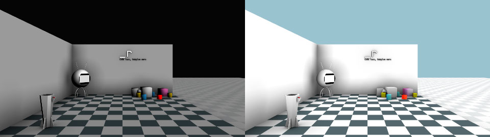
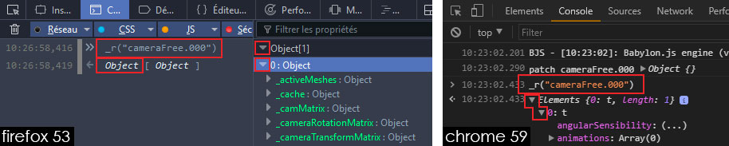
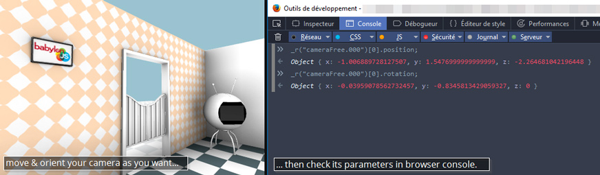
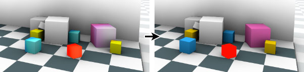
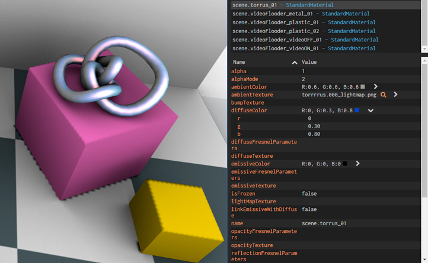

# Tutorials

## Basics

We assume that you know how to export a *.babylon* file from your 3D modeling software (we'll use Blender here), and that this *.babylon* contain at least one camera, one light and one object. For testing locally your scene, you have to launch a local web server (e.g. on Windows: [EasyPhp](http://www.easyphp.org/), [WampServer](http://www.wampserver.com/), ...). See an example on [BJS doc](http://doc.babylonjs.com/exporters/working_with_blender).

Our babylon example file is in _babylon-runtime\docs\assets_ folder, and blender file in _babylon-runtime\docs\assets-sources_.

### Starting with index.html

To load and init a very basic scene with babylon-runtime, you have to tell to babylon:

- where is the babylon file,
- what camera will be used at launch.

So let's go, here our html file:

```html
<!DOCTYPE html>
<html>
<head>
    <meta charset="UTF-8">
    <title>_r.launch</title>
	<script src="../../assets/js/babylon.js"></script>
	<script src="../../../dist/babylon-runtime.js"></script> 
</head>
<body>
<script>
    _r.launch({
        scene: "scene.babylon",
        assets: "../../assets/",
        activeCamera: "cameraFree.000"
    })
</script>
</body>
</html>
```
[launch demo scene](demos/launch)

As you can see, babylon-runtime (we will name it ```_r``` ) just need 3 parameters to launch a babylon file :
- the .babylon file name,
- where is the .babylon file,
- what camera at launch.

Once our scene is loaded, we probably want to tweak scene properties, such as *ambientColor*, so here comes patches!

### Let's do some patches

 We'll have our *.babylon* file, that could be update anytime during our 3D scene production.

Patches will helps us to keep our scene modifications even if we re-export & reload our scene from our 3D modeling software every 5 minutes.

 How to start patching? Here an example:

```javascript
    _r.launch({
        scene: "scene.babylon",
        assets: "../../assets/",
        activeCamera: "cameraFree.000",
        patch:
    	[
    		{
    			"scene":
    			{
    				"ambientColor": "#ffffff",
    				"clearColor": "#9CC1CE"
    			}
    		}
    	]
    });
```

We've just tell to babylon-runtime to patch our scene, by setting its *ambientColor* to white and its *clearColor* to blue.



[launch demo scene](demos/launch/index2.html)

Hmm ok, but what is this weird way to arrange data?

#### Take a look at JSON syntax

Explanations about [JSON](https://en.wikipedia.org/wiki/JSON) syntax must be made, you'll find a [dedicated page here](json-syntax.html). 

Read it and come back, you'll be ready to patching your BJS scene in every directions.

#### How to get and tweak properties

So, in our babylon scene, we quickly realize that our camera speed is a way too high. We know thanks to [BJS doc](http://doc.babylonjs.com/classes/3.0/targetcamera#speed-number) that our cam have a speed property. But what is the current value? Two solutions:
  - ask to ```_r```:
    - open your browser console (usually ```F12``` key),
    - type ``` _r("cameraFree.000") ``` (we named it like this in our 3D modeling software),
      
      - pro-tip: notice that you receive a table, here with only one element. For direct access when you know there is only one object, you can type ``` _r("cameraFree.000")[0] ``` to go directly to the first object in this table,
    - you can know check the speed value,
    - to tweak it, just edit the number.
  - get it via BJS inspector (since BJS 3.0):
    - open your browser console (usually ```F12``` key),
    - type ``` _r.showDebug(); ```,
    - go to _Cameras_ tab, select the desired camera and check its value,
    - to tweak it, just edit the number.

Now we enjoy our new speed value, we have to save it in a patch.

We have to add a selector of our camera, including our custom speed value. Since we know JSON syntax, we guess that we're going to integrate this piece of data in our _index.html_:

```JSON
{ "cameraFree.000": { "speed": 0.05 } }
```

So do it!

```javascript
    _r.launch(
    {
    	scene: "scene.babylon",
    	assets: "../../assets/",
    	activeCamera: "cameraFree.000",
    	patch:
        [
            {
    			"scene":
    			{
    				"ambientColor": "#ffffff", /* comma */
    				"clearColor": "#9CC1CE" /* last property, so no comma */
    			}
    		}, /* don't forget this comma */
    		{
    			"cameraFree.000":
    			{
    				"speed": 0.05 /* only one property, no comma */
    			}
    		} /* no comma here 'cause it's the end of the last element */
    	]
    }
    );
```

Do you want also set camera FOV, position & rotation at spawn? No problem:

```javascript
    _r.launch(
    {
    	scene: "scene.babylon",
    	assets: "../../assets/",
    	activeCamera: "cameraFree.000",
    	patch:
        [
            {
    			"scene":
    			{
    				"ambientColor": "#ffffff",
    				"clearColor": "#9CC1CE"
    			}
    		},
    		{
    			"cameraFree.000":
    			{
    				"speed": 0.05,
                    "fov": 1.1,
    				"position":
    				{
    					"x": 2.72,
    					"z": -1.91
    				},
    				"rotation":
    				{
    					"x": 0.11,
    					"y": -0.43
    				}
    			}
    		}
    	]
    }
    );
```
To get coordinates, you just had to move and orient your camera in BJS scene to the desired place, then type ``` _r("cameraFree.000")[0].position; ``` and ``` _r("cameraFree.000")[0].rotation; ``` in console, and report values to the patch.



[launch demo scene](demos/first-patches)

#### Starting to customize materials

In our demo scene, due to lightmap textures in *ambientTexture* channel, we want to control material color with *ambientColor*, and set *diffuseColor* to black by default (to reset its influence, and tweak it later if needed).

One way to do this is to apply a patch for each materials, one by one:

```javascript
{
  "scene.multiCube_01":
  {
    "diffuseColor": "#000000"
  }
},
{
  "scene.multiCube_02":
  {
    "diffuseColor": "#000000"
  }
},
/* and so on... */
```
But, you'll admit it, it's a little pain to select all materials like this ; obviously, there is an easy way.

By using star selector ``` * ```, you can tell to ```_r``` that you want to select all elements. Here some usage examples, to try in the browser console:

  - ``` _r("*") ``` will return all elements of the current scene (objects, materials, lights, etc),
  - ``` _r("*:mesh") ``` wil return all objects,
  - ``` _r("*:material") ``` wil return all materials,
  - ``` _r("*Cube*") ``` will return all elements which contains _Cube_ in their names,
  - ``` _r("*01") ``` will return all elements where names end with _01_,
  - ``` _r("p*") ``` will return all elements where names start with _p_,
  - ``` _r("*Cube*01") ``` will return all elements which contains _Cube_ in their names and end with _01_.

Time to enhance our patch:

```javascript
    _r.launch(
    {
    	scene: "scene.babylon",
    	assets: "../../assets/",
    	activeCamera: "cameraFree.000",
    	patch: [
    		{
    			"cameraFree.000":
    			{
    				"speed": 0.05,
    				"fov": 1.1,
    				"position":
    				{
    					"x": 2.72,
    					"z": -1.91
    				},
    				"rotation":
    				{
    					"x": 0.11,
    					"y": -0.43
    				}
    			}
    		},
            {
                "*:material": /* select all materials in scene... */
                {
                    "diffuseColor": "#000000" /* ... and set diffuse color to black */ 
                }
            }
    	]
    }
    );
```


[launch demo scene](demos/first-patches/index2.html)

You can know try to customize any material. Probably the easy way to access and tweak data is via BJS debug layer.
Here an quick example with the torrus:


```javascript
    _r.launch(
    {
    	scene: "scene.babylon",
    	assets: "../../assets/",
    	activeCamera: "cameraFree.000",
    	patch:
        [
            {
    			"scene":
    			{
    				"ambientColor": "#ffffff",
    				"clearColor": "#9CC1CE"
    			}
    		},
    		{
    			"cameraFree.000":
    			{
    				"speed": 0.05,
    				"fov": 1.1,
    				"position":
    				{
    					"x": 2.72,
    					"z": -1.91
    				},
    				"rotation":
    				{
    					"x": 0.11,
    					"y": -0.43
    				}
    			}
    		},
            {
                "*:material": /* select all materials in scene... */
                {
                    "diffuseColor": "#000000" /* ... and set diffuse color to black */ 
                }
            },
            {
                "scene.torrus_01":
                {
                    "diffuseColor":{"r": 0, "g": 0.3, "b": 0.8},
                    "ambientColor":{"r": 0.6, "g": 0.6, "b": 0.6},
                    "specularColor":{"r": 1, "g": 0.4, "b": 0.4},
                    "specularPower": 10
                }
            }
    	]
    }
    );
```
[launch demo scene](demos/first-patches/index3.html)

#### Some bits of organisation

Assume you have tons of materials, your _index.html_ will be probably messy.
So, is there a way to confine patches to external files? Yes.

Create a folder named as you want, near your _index.html_, then create one file named _cameras.patch_, another named _scene.patch_ and one more named _materials.patch_.

As you can guess, you can now cut & paste patch data from your _index.html_ to the right _.patch_ files ; and tell to ```_r``` where are stored this patches.

Things to know:
- patch file must have _.patch_ extension,
- entire patch file content must be included in square brackets __[ ]__ (one patch file is an array).

> scene.patch

```javascript
[
	{
		"scene":
		{
			"ambientColor": "#ffffff",
			"clearColor": "#9CC1CE"
		}
	}
]
```

>   cameras.patch

```javascript
[
	{
		"cameraFree.000":
		{
			"speed": 0.05,
			"fov": 1.1,
			"position":
			{
				"x": 2.72,
				"z": -1.91
			},
			"rotation":
			{
				"x": 0.11,
				"y": -0.43
			}
		}
	}
]
```

>   materials.patch

```javascript
[
	{
		"*:material":
		{
			"diffuseColor": "#000000"
		}
	},
	{
		"scene.torrus_01":
		{
			"diffuseColor":
			{
				"r": 0,
				"g": 0.3,
				"b": 0.8
			},
			"ambientColor":
			{
				"r": 0.6,
				"g": 0.6,
				"b": 0.6
			},
			"specularColor":
			{
				"r": 1,
				"g": 0.4,
				"b": 0.4
			},
			"specularPower": 10
		}
	}
]
```

> index.html

```html
<!DOCTYPE html>
<html>
<head>
    <meta charset="UTF-8">
    <title>_r / patches</title>
	<script src="../../assets/js/babylon.js"></script>
	<script src="../../../dist/babylon-runtime.js"></script> 
</head>
<body>
<script>
    _r.launch(
    {
    	scene: "scene.babylon",
    	assets: "../../assets/",
    	activeCamera: "cameraFree.000",
    	patch: 
    	[
    		"patches/scene.patch",
    		"patches/cameras.patch",
    		"patches/materials.patch"
    	]
    }
    );
</script>
</body>
</html>
```
[launch demo scene](demos/first-patches/index4.html)

This is a clearer way to work isn't it? You can create any files you want if you need, this can help for team work.

## Advanced

At this point, you may be interested by the [tips page](runtime-tips.html), take a look and come back.

### Advanced materials options

#### Fresnel

As we have seen when configuring colors, some properties required other properties in value.
_diffuseColor_ can be set with an unique value in hexadecimal, but can also be composed of RGB color, having _R_, _G_ and _B_ channels to specify.

Fresnel is one of these multi-properties. [As seen in the BJS doc'](http://doc.babylonjs.com/classes/2.5/standardmaterial#diffusefresnelparameters-fresnelparameters-classes-2-5-fresnelparameters-), we have different types of fresnel.

To active one of these, just report it as shown below. Here an example with emissiveFresnelParameters:

```JSON
{
    "myMaterial":
    {
        "emissiveFresnelParameters":
        {
            "leftColor": "#ffffff",
            "rightColor": "#000000",
            "power": 1,
            "bias": 0
        }
    }
}
```
And a patch example in our demo scene:
```JSON
{
    "scene.strangeThing_porridge_01":
    {
        "diffuseColor": { "r": 0.1, "g": 0.1, "b": 0.1 },
        "ambientColor": { "r": 0.6, "g": 0.7, "b": 0.8 },
        "emissiveColor": { "r": 1, "g": 0.2, "b": 0 },
        "useEmissiveAsIllumination": true,
        "emissiveFresnelParameters":
        {
            "leftColor": "#ffffff",
            "rightColor": "#000000",
            "power": 1,
            "bias": 0
        },
        "specularColor": { "r": 0.5, "g": 0.1, "b": 0 },
        "specularPower": 7
    }
}
```
[launch demo scene](demos/advanced-materials-options/)


#### Texture creation

You can create or replace texture on the fly. We're going to test this on the TV screen.

##### Classic textures

We want to select our screen material, and modify its *diffuseTexture*. Here how to do that:
```javascript
{
  "myMaterial":
  {
    "diffuseTexture":
    {
      "texture::base":
      {
        "url": "my/path/to/texture.file"
      }
    }
  }
}
```
So in our demo scene, we have to write:
```javascript
{
  "scene.videoFlooder_video_01":
  {
    "diffuseTexture":
    {
      "texture::base":
      {
        "url": "../../assets/painting01.png"
      }
    },
    "ambientColor": "#ffffff"
  }
}
```

[launch demo scene](demos/advanced-materials-options/index2.html) (patch is place directly in the index.html here)

##### Videos

##### cubemaps

### Create user interactions

That's right, you can react to some user actions with patches!

Suppose we want a color modification when user click (or touch) on ```_r``` logo on the wall.

Here we call __OnPickUpTrigger__ function. How to implement it ?

```javascript
{
    "myObject":
    {
        "OnPickUpTrigger": function ()
        {
            /* this is javascript */
            alert("alerts hurts.");
        }
    }
}
```
As you can see, here we have to work with javascript. But we can use ```_r``` to easily access to objects. In our demo scene, let's create a file named _interactions.patch_ (don't forget to add it in index.html patch list).
Here our new file:
```javascript
[
	{
		"runtime.000:mesh":
		{
			"OnPickUpTrigger": function ()
			{
				/* this is javascript */
				_r("scene.runtime_02")[0].ambientColor = _r.color("#ff3300"); /* color need to be converted by _r.color function, 'cause we're in javascript and not JSON */
			}
		}
	}
]
```

Over-complicated code here, to alternate colors on click:

```javascript
[
	{
		"runtime.000:mesh":
		{
			"OnPickUpTrigger": function ()
			{
                var logoColor = _r("scene.runtime_02")[0].ambientColor;
                if(logoColor == "{R: 1 G:1 B:1}")
                    _r("scene.runtime_02")[0].ambientColor = _r.color("#ff3300");
                else
                    _r("scene.runtime_02")[0].ambientColor = _r.color("#ffffff");
			}
		}
	}
]
```
[launch demo scene](demos/user-interactions/)

### Import other .babylon in scene

For some reasons, we have split our final scene into multiple babylon files. Obviously we want to merge them. There is a runtime function for that, named ```_r.library.show()```.
As it is a javascript function, you can't include it on a patch. We'll use the ```_r.ready()``` function to call _library.show_.

Here the code structure:

```javascript
_r.ready(function(){
    _r.library.show({
        "name": "giveAName",
        "rootUrl": "path/to/file/",
        "fileName": "myFile.babylon"
    });
});
```
And with our demo scene as example:
```javascript
_r.ready(function(){
    _r.library.show({
        "name": "wonderfulFloatingSphere",
        "rootUrl": "../../assets/wonderfulFloatingSphere/",
        "fileName": "wonderfulFloatingSphere.babylon"
    });
});
```
[launch demo scene](demos/user-interactions/index2.html)

We now want this sphere to float in the air, so is this about patching? Yes it is:
```javascript
_r.ready(function(){
    _r.library.show({
        "name": "wonderfulFloatingSphere",
        "rootUrl": "../../assets/wonderfulFloatingSphere/",
        "fileName": "wonderfulFloatingSphere.babylon",
        "patch":
        [
            {
                "wonderfulFloatingSphere.000:mesh":
                {
                    "position":
                    {
                        y: 1.5
                    }
                }
            }
        ]
    });
});
```
And of course we can write patches in a file, saved where you want:
:
```javascript
_r.ready(function(){
    _r.library.show({
        "name": "wonderfulFloatingSphere",
        "rootUrl": "../../assets/wonderfulFloatingSphere/",
        "fileName": "wonderfulFloatingSphere.babylon",
        "patch":
        [
            "patches/wonderfulFloatingSphere.patch"
        ]
    });
});
```

[launch demo scene](demos/user-interactions/index3.html)

How about load this sphere only when user click on the red button?
__Delete__ our ```_r.ready``` function in our _index.html_, and go to our _interations.patch_ file:

> interations.patch

```javascript
{
    "magicButton.000:mesh":
    {
        "OnPickUpTrigger": function ()
        {
            _r.library.show(
            {
                "name": "wonderfulFloatingSphere",
                "rootUrl": "../../assets/wonderfulFloatingSphere/",
                "fileName": "wonderfulFloatingSphere.babylon",
                "patch":
                [
                    "patches/wonderfulFloatingSphere.patch"
                ]
            }
            );
            _r("decals.000:mesh")[0].isVisible = true;
            _r("scene.pedestal_02:material")[0].emissiveColor = _r.color("#FFCCBF");
            _r("scene.pedestal_02:material")[0].useEmissiveAsIllumination = true;
        }
    }
}
```

We just tell to ```_r``` that when user click on red button:

-   please import a *.babylon* file,
-   then set visible a mesh,
-   and do some operations to a material.

[launch demo scene](demos/user-interactions/index4.html) - view [interactions.patch](demos/user-interactions/patches/interactions.patch)

### Animate things

This sphere is a little too static isn't it? Once the red button clicked, we will add animation on sphere Y axis.
Here comes the ```_r.animate()``` function:

```javascript
_r.animate("elementToAnimate", { "property": value }, duration);
```
or with more anim' options:
```javascript
_r.animate("elementToAnimate", { "property": value }, { duration, easing });
```
Check [easings.net](http://easings.net) to see all possibilities of easing.

You have several objects to anim'?

```javascript
_r.animate(
	{
    	"elementToAnimate": { "property": value },
        "elementToAnimate": { "property": value },
        "elementToAnimate": { "property": value, "property": { "subproperty" : value, "subproperty" : value } }
	}, duration);
```
So for our sphere, we have to write:
```javascript
_r.animate(
    "wonderfulFloatingSphere.000:mesh",
    {
        "position":
        {
            "y": 1.7
        }
    },
    {
        "duration": 2,
        "easing": "easeInOutSine"
    }
);
```
This will select the sphere, animate its Y position from original position to y = 1.7, during 2 seconds, using an easeInOutSine movement.

In our _interactions.patch_ file, we naturally add our _animate_ after import our .babylon:
> interations.patch

```javascript
{
    "magicButton.000:mesh":
    {
        "OnPickUpTrigger": function ()
        {
            _r.library.show(
            {
                "name": "wonderfulFloatingSphere",
                "rootUrl": "../../assets/wonderfulFloatingSphere/",
                "fileName": "wonderfulFloatingSphere.babylon",
                "patch":
                [
                    "patches/wonderfulFloatingSphere.patch"
                ]
            }
            );
            _r("decals.000:mesh")[0].isVisible = true;
            _r("scene.pedestal_02:material")[0].emissiveColor = _r.color("#FFCCBF");
            _r("scene.pedestal_02:material")[0].useEmissiveAsIllumination = true;
            _r.animate(
                "wonderfulFloatingSphere.000:mesh",
                {
                    "position":
                    {
                        "y": 1.7
                    }
                },
                {
                    "duration": 2,
                    "easing": "easeInOutSine"
                }
            ); 
        }
    }
}
```

By testing this, you'll soon see that... it doesn't work. We can see a warning in our browser console: ```BABYLON.Runtime::no object(s) found for selector "wonderfulFloatingSphere.000:mesh"```.
This is 'cause javascript can run functions in asynchronous way, so here it try to animate an object which is not yet import in scene!

Don't panic, there is a way to force a function to wait another function, by using __.then()__.

Here how to use it:

> interations.patch

```javascript
{
    "magicButton.000:mesh":
    {
        "OnPickUpTrigger": function ()
        {
            /* this is javascript */
            console.log("red magic button picked !");
            _r.library.show(
            {
                "name": "wonderfulFloatingSphere",
                "rootUrl": "../../assets/wonderfulFloatingSphere/",
                "fileName": "wonderfulFloatingSphere.babylon",
                "patch":
                [
                    "patches/wonderfulFloatingSphere.patch"
                ]
            }
            ).then(function()
                /* we have to wait end of import, then we can animate */
                {
                    _r.animate(
                        "wonderfulFloatingSphere.000:mesh",
                        {
                            "position":
                            {
                                "y": 1.7
                            }
                        },
                        {
                            "duration": 2,
                            "easing": "easeInOutSine"
                        }
                    );
                });                
            _r("decals.000:mesh")[0].isVisible = true;
            _r("scene.pedestal_02:material")[0].emissiveColor = _r.color("#FFCCBF");
            _r("scene.pedestal_02:material")[0].useEmissiveAsIllumination = true;
        }
    }
}
```
Job done!

### Add custom properties to an element


### Use ```_r``` and write my own javascript as well


### With ```_r()``` selector, do actions on multiple elements, not just [0]

As we already seen above, we know the selector ```_r("myElement")[0]``` give direct access to element. This is because ```_r("myElement")``` send us a table.
For example, typing ```_r("*:material")```give us all materials in scene.

Suppose we want all this materials with a red *ambientColor*. We're going to use a javascript function called __each() __.

Type:

```javascript
_r("*:material").each( function(element){ element.ambientColor = _r.color("#ff0000"); } )
```
It works! All our materials are now red.
Code formatted for clarity:

```javascript
_r("*:material").each(
	function(element){
		element.ambientColor = _r.color("#ff0000");
    }
)
```

But this is not very a quick method, this is why we have the ```_r``` __attr__ function!
This will doing the same as above:
```javascript
_r("*:material").attr("ambientColor", _r.color("#ff0000"))
```